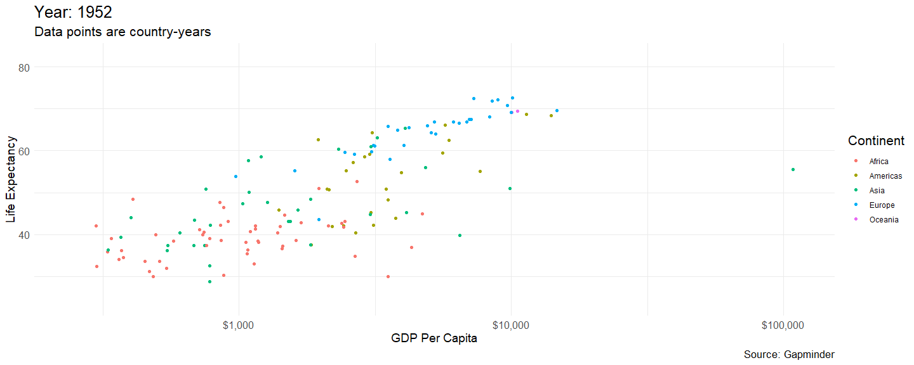

```{r setup, include=FALSE}
knitr::opts_chunk$set(echo = TRUE, message = FALSE, warning = FALSE)
knitr::opts_chunk$set(fig.height = 5.5, fig.width = 9, fig.align = "center")
knitr::opts_knit$set(root.dir = "C:\\Users\\nicho\\OneDrive\\Documents\\Teaching\\ANL501\\Course Content\\course_notes\\current\\Seminar 1")


xaringanExtra::use_panelset()
ggplot2::theme_set(ggplot2::theme_minimal(base_size = 16))
```

```{r xaringan-themer, include = FALSE, warning = FALSE}
library(xaringanthemer)
style_duo_accent(
  primary_color = "#0492C2",
  secondary_color = "#F1DE67",
  inverse_header_color = "#464a53",
  black_color = "#464a53",
  code_highlight_color = "#f1de67",
  header_font_google = google_font(family = "Roboto"),
  text_font_google   = google_font("Roboto", "300", "300i"),
  code_font_google   = google_font("Source Code Pro"),
  code_font_size = "20px",
  title_slide_text_color = "#FFFFFF",
  title_slide_background_color = "#92cdcd",
 # title_slide_background_image = "https://raw.githubusercontent.com/nicholas-sim/anl501/main/maldives1.jpg",
  title_slide_background_size = "contain",
  base_font_size = "24px",
  header_h1_font_size = "2rem",
  header_h2_font_size = "1.75rem",
  header_h3_font_size = "1.5rem",
  extra_css = list(
    "h1" = list("margin-block-start" = "0.4rem", 
                 "margin-block-end" = "0.4rem"),
    "h2" = list("margin-block-start" = "0.4rem", 
                 "margin-block-end" = "0.4rem"),
    "h3" = list("margin-block-start" = "0.4rem", 
                 "margin-block-end" = "0.4rem"),
    ".small" = list("font-size" = "90%"),
    ".midi" = list("font-size" = "85%"),
    ".large" = list("font-size" = "200%"),
    ".xlarge" = list("font-size" = "600%"),
    ".hand" = list("font-family" = "'Gochi Hand', cursive",
                   "font-size" = "125%"),
    ".task" = list("padding-right"    = "10px",
                   "padding-left"     = "10px",
                   "padding-top"      = "3px",
                   "padding-bottom"   = "3px",
                   "margin-bottom"    = "6px",
                   "margin-top"       = "6px",
                   "border-left"      = "solid 5px #F1DE67",
                   "background-color" = "#F1DE6750"),
    ".pull-left" = list("width" = "49%",
                        "float" = "left"),
    ".pull-right" = list("width" = "49%",
                         "float" = "right"),
    ".pull-left-wide" = list("width" = "70%",
                             "float" = "left"),
    ".pull-right-narrow" = list("width" = "27%",
                                "float" = "right"),
    ".pull-left-narrow" = list("width" = "27%",
                               "float" = "left"),
    ".pull-right-wide" = list("width" = "70%",
                              "float" = "right") 
    )
  )
```


```{r echo = F}
# Importing packages
library(tidyverse)
library(socviz)
library(knitr)
```


# Administrative Matters

---
### Overview

* Data visualization 
  - Learn to use R/R Studio (optional class on Python)
  - Storytelling with data 
        
* Main text is Data Visualization: A Practical Introduction by Kieran Healy
  - https://socviz.co (free access to book content)
  
* Other useful resources:
  - R for Data Science by Hadley Wickham (https://r4ds.had.co.nz/index.html)
  - RMarkdown: A Definitive Guide by Yihui Xie,  J. J. Allaire, Garrett Grolemund (https://bookdown.org/yihui/rmarkdown/)
  - R Gallery Book by Kyle Brown (https://bookdown.org/content/b298e479-b1ab-49fa-b83d-a57c2b034d49/)
  - Storytelling with Data by Cole Nussbaumer-Knaflic (non-R)
  
* More advanced plotting
  - Interactive web-based data visualization with R, plotly, and shiny. (https://plotly-r.com/) 


---
### Assessments

* Assessments
    - Pre-course Quiz 10%
    - Tutor-Marked Assignment (TMA) 30%
    - Participation 10%
    - End-of-course Assignment (ECA) 50%
    
---
### Submission

* Submission of assignments must be done via Canvas only.

* Please note that the datelines are **hard** (marks deduction will automatically be applied to late submissions). 

* Please submit your assignment early if you are unable to submit on the dateline itself (e.g. travel for work).

* You must submit your assignment as a Word document. Submission of R/RMarkdown  scripts only (without a Word document) will not be accepted.

---
### Attendence

* Attendance is compulsory.

* To receive SSG funding, you must achieve at least 75% attendance **AND** pass the course.

---
### Passing the Course

* You must **pass** both the OCAS (Overall Continuous Assessment Score) and the OES (Overall Examinable Score) components (i.e. $\ge 40\%$) to pass the course.

* If you do not submit the TMA, 

    -   but submit the ECA, you will receive an "F" grade automatically.
    -   and do not submit the ECA, you will receive an "W" grade automatically.
    
* You **cannot pass the course** by submitting the ECA but not the TMA. 

---
# Analytics and Visualisation 

---
### What is Data Visualisation? 

Data analytics is the use of computing and statistical methods to generate information and insights from data.

These techniques may involve **data visualisation** or **machine learning**.

"Data visualization is the graphical representation of information and data" (www.tableau.com). It is usually the step prior to taking the data to machine learning models.

Machine learning is the use of computer algorithms and statistical theories to generate information, often for the purpose of predictions. These approaches can broadly be classified into supervised learning, unsupervised learning, and reinforcement learning.

---
### What is Required for Successful Data Storytelling?

* Ability to manage and transform data

  - Customization of data visualisation for storytelling requires significant work and understanding on what data structure one should have and how to achieve it (e.g. group level aggregation, pivoting, etc.).
  
  
* Ability to identify the message to convey

  - This requires significant exploratory data analysis, such as  exploratory data visualisations for data understanding that will not be reported.


* Ability to use a flexible computing tool

  - R will be used in this course.


---
### Course Coverage 

* How to manage and clean data.

* Fundamental principles of data visualisation (Grammar of Graphics)

* A software (i.e. R) with the flexibility for highly customized data visualisations (for storytelling)


Note: We will not cover everything about R, but enough to the point that enable you to carry out more complex work with R.

---
# Course Structure 

---
### Seminars 1-3

* **Pre-Course Seminar**
  1. Basic R Operations
  2. R Programming
  
* **Seminar 1**
  1. Course Introduction 
  2. Suggested Practices in Data Storytelling
  3. Data Management in Base R  


* **Seminar 2**

  1. Data Management with Tidyverse
  2. Data Storytelling and the Grammar of Graphics
  
  
* **Seminar 3**
  
  1. Getting Started with Data Visualisation
  2. A First Look at ggplot  
  3. Aesthetics and Settings
  4. More on Grammar of Graphics

---
### Seminars 4-6


* **Seminar 4**
  1. Introduction to RMarkdown
  3. Pivot Tables 
  4. Time Series Plots, Bar Charts, Histograms and Densities
  
  
* **Seminar 5**
  1. Column Charts and Data Preprocessing
  2. Boxplots and Annotation
  2. Choropleth Maps


  
* **Seminar 6**
  1. Spatial Visualisation with ggmap
  2. Statistics and Regression
  3. Storyboarding

  
  

* **Optional Materials**
  1. Python Programming and Seaborn

---
### Expectations 

Hours Per Week:

1. Seminars (mandatory) - 3 
2. Pre-class readings (slides) - 1  
3. Post-class readings (slides and assigned text) and practice - 3 
4. Assessments - 3 
5. Others (e.g. Datacamp) - 0.5 

---
### Success Factors

* Practice and try things out on your own.

* Play around with the source files of the slides, which are created from RMarkdown.

* Be very familiar with data frames and data wrangling tools like the `dplyr` package.

* Memorize a few basic lines on how to construct visualisations with the `ggplot` package, especially the use of basic features such as aesthetics, settings, labs (i.e. plot labels), scales, and theme. 

---
# R For Data Analytics and Visualisation

---
### Why R? 


1. Open Source.

2. Capability - A massive library of statistical packages.
  
3. Integrates easily with other software, e.g. Python, SQL, etc. (e.g.  `reticulate` package integrates python functions in R).

4. Relatively easy to learn, particularly with the `tidyverse` library.

5. Reproducible reports, i.e. RMarkdown (covered here), Quarto.

6. Highly flexible.

7. Few data limitations, e.g. an Excel workbook can hold ~1 million records, but R (also Python) can hold ~ $2^{31} - 1$ records. 

8. Popular among data analysts/scientists.


---
### Why Code?

Read: https://www.r-bloggers.com/2020/12/6-reasons-to-learn-r-for-business-2021/

```{r echo=FALSE, out.width = "70%"}
library(tidyquant)
library(ggrepel)
data_apps <- tribble(
  ~application, ~business_capability, ~ease_of_learning, ~trend, ~cost,   
  "R",          10,                   4,                 10,     "Free",
  "Python",     7,                    4,                 10,     "Free",
  "Excel",      4,                    10,                7,      "Low",
  "Tableau",    6,                    7,                 6,      "Low",
  "PowerBI",    5,                    8,                 6,      "Low",
  "Matlab",     6,                    2,                 1,      "High",
  "SAS",        8,                    4,                 3,      "High"
)
cap <- paste0(
  "Why R? Tools like Excel, Tableau, PowerBI are easier to learn, but have lower ",
  "Business Capability. Tools like Python, SAS, and Matlab have high ",
  "Data Science Capability, but lack the visualization and interactive ",
  "application tools needed for business. R has the best data science, visualization, ",
  " and interactive tools plus it's free!"
  )
data_apps %>%
  ggplot(aes(x = business_capability, y = ease_of_learning, 
             color = cost, size = trend)) +
  geom_point() +
  geom_label_repel(aes(label = application, fill = application), 
                   size = 3.5,
                   fontface = 'bold', color = 'white',
                   box.padding = 0.1, point.padding = 0.5,
                   segment.color = 'grey50', segment.size = 1) +
  geom_smooth(color = palette_dark()[[1]], method = "lm", se = FALSE, show.legend = F) +
  expand_limits(x = c(0, 10), y = c(0, 10)) +
  theme_tq() +
  theme(legend.direction = "vertical") +
  scale_fill_tq() +
  scale_color_tq() +
  scale_y_continuous(breaks = seq(0, 10, 2)) +
  scale_x_continuous(breaks = 0:10) +
  scale_size_continuous(range = c(2, 14)) + 
  labs(title = "DS4B Tools: Capability Vs Learning Curve",
       subtitle = "R has a longer learning curve but has a massive business capability rating",
       caption = label_wrap_gen(115)(cap),
       x     = "Data Science For Business Capability Rating",
       y     = "Learning Curve Rating",
       color = "Cost",
       size  = "Trend",
       fill  = "Tool")
```

---
### Example - Scatter Plot 

Seminar 3 (Scatter Plot with Color Aesthetics)

```{r echo=F, out.width = "70%"}
library(gapminder)
p <- ggplot(data = gapminder, mapping = aes( x = gdpPercap, y = lifeExp)) 

p + geom_point(mapping = aes(color = continent)) + geom_smooth(method = "lm", se = FALSE) + scale_x_log10(labels = scales::dollar) +
  labs(x = "GDP Per Capita", y = "Life Expectancy", 
       title = "Economic Growth and Life Expectancy", 
       subtitle = "Data points are country-years",
       color = "Continent",
       caption = "Source: Gapminder") +
  theme_minimal() +
  theme(title = element_text(size=16),
        axis.text.x = element_text(size = 12), # x-axis grid text
        axis.text.y = element_text(size = 12), # y-axis grid text
        axis.title = element_text(size = 14))  # axis title text
```

---
### Example - Animation 

Seminar 3 (Animations)




See, also, https://www.youtube.com/watch?v=SnCi0s0e4Io

---
### Example - Creating Facets 

Seminar 4 (Line Plots with Facets)

```{r echo=F, out.width = "70%"} 
library(tidyverse)
pm10 <- read_csv("pm10.csv") # From dplyr package

# Extract the national pollution index
pm10.national <- subset(pm10,region %in% c("national"), 4) %>% 
  as.data.frame()

df.national <- arrange(pm10, region) # arrange the pm10 data according to region.

# combine the national pollution series. Exploit the recycling property of R
# The national pollution index is now index.1  
df.national <- data.frame(df.national, pm10.national) 


p2 <- ggplot(data = filter(df.national,region %nin% c("national")))

p2 + geom_line(mapping = aes(x = psi_date, y = index, group = region), size=0.9) + # color the line plots  
  labs(y = "PM 10 Readings at 5pm", x="", title = "PM 10 Readings For April 2020")+
    facet_wrap(.~region)+
  geom_line(mapping = aes(x = psi_date, y = index.1, group = region), size=0.9, color = "gray70", alpha=0.5)+
   annotate(geom = "rect", xmin = as.Date("2020-04-22"), xmax = as.Date("2020-04-30"), ymin = 15, ymax = 38, alpha = .2)

```  

---
### Example - Boxplot with Flipped Coordinates

Seminar 5 (Flipped Boxplots)

```{r box.5, echo=F, out.width = "70%"}
library(gapminder)
p <- ggplot(data = organdata,  mapping = aes(x = reorder(country, donors, na.rm=TRUE),  y = donors, fill = world))  
p + geom_boxplot() + labs(x = NULL) +  coord_flip() + theme(legend.position = "top") 

```

---
### Example - Visualising Spatial Data

Seminar 5 (Choropleth Map)

```{r echo=F, out.width = "70%"}
library(socviz)
library(ggthemes)
county_full <- left_join(county_map, county_data, by = "id") 
p <- ggplot(data = county_full,  mapping = aes(x = long, y = lat,  group = group, fill = pop_dens))  
p + geom_polygon(color = "gray90", size = 0.05) + 
  coord_equal() + # `1:1 aspect for the figure 
  scale_fill_brewer(palette = "Blues",  labels = c("0-10", "10-50", "50-100", "100-500",  "500-1,000", "1,000-5,000", ">5,000"))  +  # Specify levels
  labs(fill = "Population per\nsquare mile") +  theme_map() +  
  guides(fill = guide_legend(nrow = 1))  
```

---
### Example - Using APIs 

Seminar 6 (Google Maps)

```{r echo=F}
knitr::include_graphics("dengue.png", dpi = 120)
```

---
### Example - Creating a Data Story 

Seminar 6 (Storytelling)

```{r echo=F, out.width = "70%"}
library(socviz)
party_colors <- c("#2E74C0", "#CB454A")  # These are the party colors.
p0 <- ggplot(data = subset(county_data,  flipped == "No"),  mapping = aes(x = pop,  y = black/100))  

p1 <- p0 + geom_point(alpha = 0.15, color = "gray50") +  scale_x_log10(labels=scales::comma) # without the scales::comma, the tick labels

p2 <- p1 + geom_point(data = subset(county_data,  flipped == "Yes"),  
                      mapping = aes(x = pop, y = black/100,  color = partywinner16)) +  # The party that won in the county in 2016
  scale_color_manual(values = party_colors)  

p3 <- p2 + scale_y_continuous(labels=scales::percent) +  # change the scales to percent.
  labs(color = "County flipped to... ",  x = "County Population (log scale)",  y = "Black Population (percent)",  
       title = "Flipped counties, 2016",  caption = "Counties in gray did not flip.")  
       
p4 <- p3 + geom_text_repel(data = subset(county_data,  flipped == "Yes" &  black > 25), 
                           mapping = aes(x = pop,  y = black/100,  label = state), size = 2) 
p4 + theme_minimal() +  theme(legend.position="top") 
```


